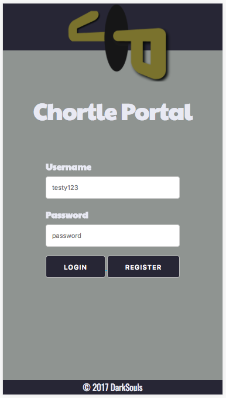
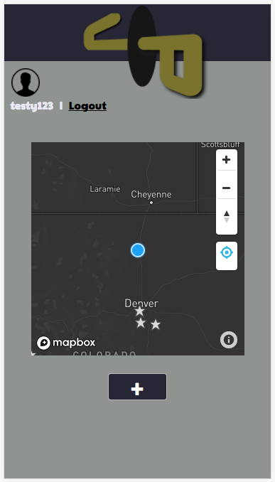
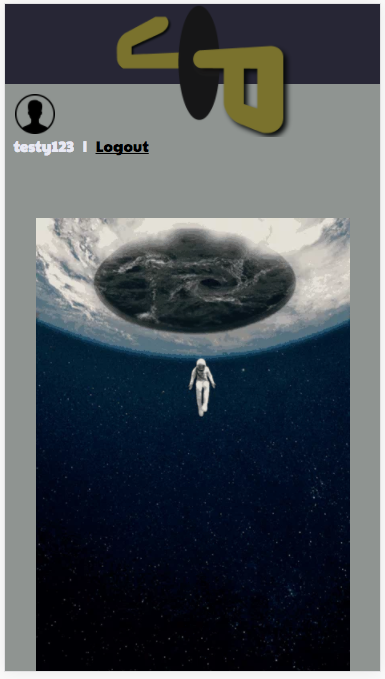
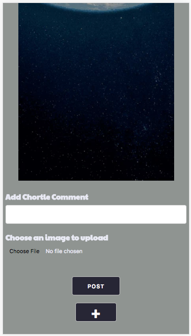
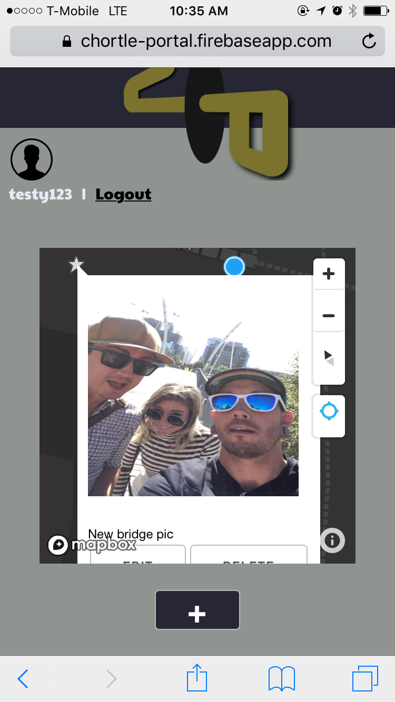

<h1 align="center">
  </img>
  <br>  
  CHORTLE PORTAL
</h1>

## About
Chortle Portal is a light-hearted, social application that connects Users to each other and their surroundings. Unlike other social apps, Chortle Portal physically connects Users to the world outside of their phones. Instead of having to check in at an established location, Users can use Chortle Portal where ever they like. From street art to a comical pedestrian, users can take pictures, add comments and drop the content to that specific location on the map to be viewed by friends at a later time.

## Created By

[Connor Alcock](https://github.com/connoralcock87)<br>
[Roxanne Baldwin](https://github.com/RoxMBaldwin)<br>
[Logan Crewss](https://github.com/lcrewss)<br>
[Michael Harrington](https://github.com/mike85h)<br>
[Dan Mickulesku](https://github.com/DMickulesku)

*special thanks to Berto and Matt for all their help*

## Deployed URLs
[Client Deployed URL: Firebase](https://chortle-portal.firebaseapp.com/main.html)

[Server Deployed URL: Heroku](https://salty-mountain-21631.herokuapp.com/)

## Repositories

[Team: Dark Souls](https://github.com/DarkSoulsMongo)

[Server Side Repository](https://github.com/DarkSoulsMongo/ChortlePortal-server)

 -  *to install all server dependancies:*
```
npm install
```

## Technologies Used


## Presentation

[Presentation Slides](https://prezi.com/d-5dlokhfmvb/chortle-portal/)

[Youtube Demonstration Video](https://www.youtube.com/watch?v=Yn5Do6cTrAI&feature=youtu.be)

## Wireframes

**Landing Page:**


**Main App:**


**Post Chortle:**


## Story Tracker
[User Stories on Pivotal Tracker](https://www.pivotaltracker.com/n/projects/2110435#)

## Mobile Viewport | iPhone 6
**Login:**




**Main Map:**



**Form:**







**POST Success:**


